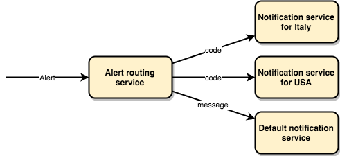
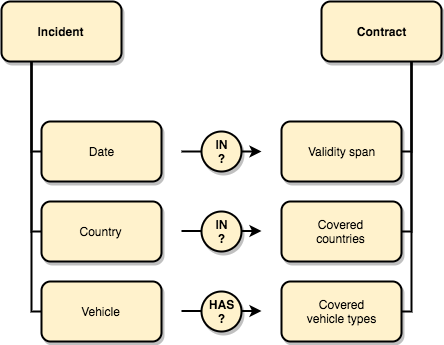
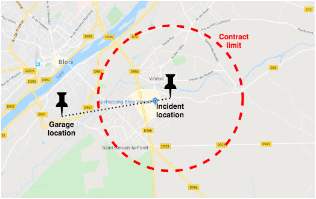
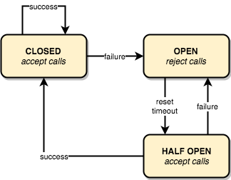

# Hands-on: Property-Based Testing in Java with Jqwik

## How to proceed
Clone project locally:
`git clone https://github.com/sylvaindecout/jqwik-handson.git`

Run tests:
`./mvnw clean test`

Run mutation coverage:
`./mvnw org.pitest:pitest-maven:mutationCoverage`

A dedicated package is available in test folder for each exercise.
Instructions are available as TODO tasks.

Prerequisite: Java 17+

## Exercises
1. Basic properties
2. Basic parameter constraints
3. Basic providers
4. Complex providers
5. Complex parameter constraints
6. Dependent parameters
7. Configuration
8. Borderline cases
9. Stateful testing

### 1. Basic properties
Create property-based tests for a method with null-checks.

### 2. Basic parameter constraints
Create property-based tests for a value object with basic validity constraints.

### 3. Basic providers
Add basic parameter to property-based test by defining a parameter provider method.

### 4. Complex providers
Add complex parameter to property-based test by defining a simple arbitrary provider.

### 5. Complex parameter constraints
Combine parameters of property-based test by defining a complex arbitrary provider as well as custom annotations.

### 6. Dependent parameters
Add a property-based test for a method with dependent arguments, by relying on existing arbitrary providers.

### 7. Configuration
Adapt property-based test to long method execution time.

### 8. Borderline cases
Define property-based tests in a case for which it is not so straightforward.
Consider trade-offs and how you may want to use property-based testing in conjunction with example-based testing.

### 9. Stateful testing
Leverage property-based testing for a basic state machine.

